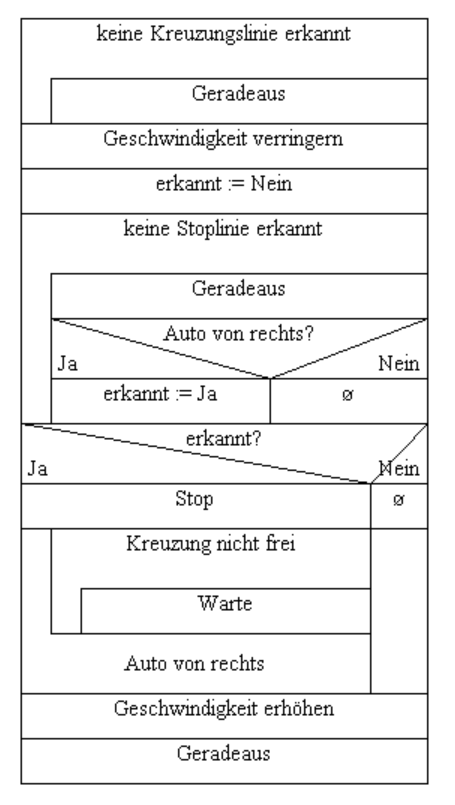

# Vorfahrtsregelung

> Ein erster Schwarmroboter fährt geradeaus und ein zweiter Schwarmroboter nähert sich von links. Der von links kommende zweite Schwarmroboter registriert den ersten Schwarmroboter und gewährt Vorfahrt.



## Struktogramm

Tool: [Struktogrammeditor](whiledo.de/index.php?p=struktogrammeditor)

Run

``` powershell
java -jar struktogrammeditor*.jar
```
