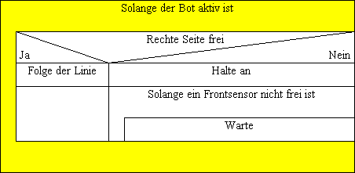

# Vorfahrtsregelung

> Ein erster Schwarmroboter fährt geradeaus und ein zweiter Schwarmroboter nähert sich von links. Der von links kommende zweite Schwarmroboter registriert den ersten Schwarmroboter und gewährt Vorfahrt.

Dieses Projekt baut auf der [botlib](https://github.com/GretaThunbergUltras/botlib) auf. Sie muss über pip3 installiert werden.

## Voraussetzungen

- Linien auf dem Boden halten das Auto in der Spur


## Struktogramm



Tool: [Struktogrammeditor](http://whiledo.de/index.php?p=struktogrammeditor)

Run

``` powershell
java -jar struktogrammeditor*.jar
```
## Nützliche Links

Bildauswertungs Library:
- OpenCV: https://opencv.org/
- ImageAI: http://imageai.org
